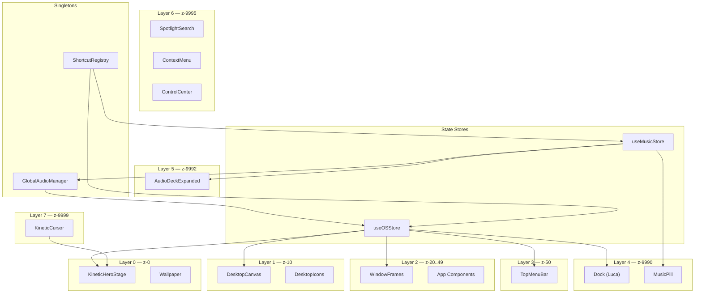

# Application Architecture — System Boundaries & Communication
## Phase 2 Architecture Document

---

## System Overview



---

## 1. Core OS System

**Responsibility**: Root container, viewport setup, theme management, layer orchestration

**Owned Components**: Root layout, CSS custom properties, `<html>` class toggling

**State Consumed**: `useOSStore.theme`, `useOSStore.desktopMode`

**State Produced**: CSS variable updates (`:root` light/dark tokens)

**Dependencies**: None (root of dependency tree)

**Communication**: Broadcasts theme via CSS class on `<html>` or `<body>`. All children read CSS custom properties reactively.

---

## 2. Window System

**Responsibility**: Window lifecycle, drag, resize, focus management, z-index ordering, cascade spawning

**Owned Components**: WindowFrame, TrafficLights, resize handles

**State Consumed**: `useOSStore.windows`, `useOSStore.activeWindowId`

**State Produced**: `openWindow()`, `closeWindow()`, `minimizeWindow()`, `toggleMaximize()`, `focusWindow()`, `updatePosition()`, `updateSize()`

**Dependencies**: Core OS (viewport bounds), Dock (minimize target coordinates)

**Communication**:
- **Inbound**: Desktop icons → `openWindow(appId)`, Dock → `focusWindow(appId)` / restore, Shortcuts → `closeWindow` / `minimizeWindow`
- **Outbound**: `activeWindowId` change → TopMenuBar updates app name, Dock reads window states for active dots

**Isolation**: Each window runs its app component in isolation. App components receive only their own state, not other windows'.

---

## 3. Desktop System

**Responsibility**: Desktop surface, icon grid, selection marquee, wallpaper/hero stage, right-click menus

**Owned Components**: DesktopCanvas, DesktopGrid, DesktopIcon, SelectionMarquee, KineticHeroStage, SplitText

**State Consumed**: `useOSStore.windows` (to show icon state), `useOSStore.desktopMode`, `useOSStore.wallpaperId`

**State Produced**: `openWindow()` on double-click, `setDesktopMode()` on ambient toggle

**Dependencies**: Window System (launches windows), Cursor System (reads cursor position for typography)

**Communication**:
- **Inbound**: Cursor position → SplitText physics, ShortcutRegistry → ambient mode toggle
- **Outbound**: `openWindow()` → Window System, `setDesktopMode()` → global

---

## 4. Navigation System

**Responsibility**: App routing, deep-linking, URL behavior

**Owned Components**: URL manager (optional — may be SPA with hash routing)

**State Consumed**: `useOSStore.activeWindowId`, `useOSStore.windows`

**State Produced**: URL updates reflecting active app [PROBABLE]

**Dependencies**: Window System

**Communication**: Bidirectional with Window System — opening a window may update URL, navigating to URL may open corresponding window.

---

## 5. Taskbar System (Luca Dock)

**Responsibility**: Primary navigation dock, parabolic magnification, app launching, music pill hosting

**Owned Components**: Dock, DockItem, DockTooltip, DockDivider, ActiveDotIndicator, MusicPlayerDockPill

**State Consumed**: `useOSStore.windows` (active dots), `useMusicStore.status` (music pill), mouse position

**State Produced**: `openWindow()`, `focusWindow()`, `minimizeWindow()` (toggle), `useMusicStore.isDeckExpanded`

**Dependencies**: Window System, Music System, Cursor System (magnetic dock state)

**Communication**:
- **Inbound**: Mouse `clientX` → magnification engine, `useOSStore.windows` → dot indicators
- **Outbound**: Click → Window System actions, Click music pill → Music System expand
- **Internal**: Shared `mouseX` MotionValue drives all DockItem widths via `useTransform`/`useSpring`

---

## 6. Widget System (Music Player)

**Responsibility**: Audio playback, visualization, media session, expanded deck UI

**Owned Components**: AudioDeckExpandedCard, VinylDiscAssembly, AudioVisualizerCanvas, InteractiveScrubber, MediaSessionController

**State Consumed**: `useMusicStore.*`

**State Produced**: `useMusicStore.play()`, `pause()`, `next()`, `prev()`, `seek()`, `setVolume()`, `toggleShuffle()`, `cycleRepeat()`

**Dependencies**: GlobalAudioManager (AudioContext, gain routing), Taskbar (pill trigger)

**Communication**:
- **Inbound**: Pill click → expand, Media Session → play/pause/next/prev, Audio element events → status updates
- **Outbound**: Play FX → GlobalAudioManager.triggerDuck(), metadata → MediaSession API
- **Isolation**: Music state is fully isolated in `useMusicStore`. No direct coupling to window system.

---

## 7. Interaction Engine (Michal Cursor + Typography Physics)

**Responsibility**: Custom cursor rendering, typography physics simulation, velocity tracking

**Owned Components**: KineticCursor, CursorPrecisionDot, CursorAuraRing, CursorStateMachine, physics integrator

**State Consumed**: Mouse events (raw), `useOSStore.desktopMode` (physics intensity), DOM `data-cursor` attributes

**State Produced**: Cursor position/velocity → SplitText force field, cursor variant → visual state

**Dependencies**: Desktop System (SplitText consumes cursor position)

**Communication**:
- **Inbound**: `pointermove` events → position tracking, DOM hover → state machine transitions
- **Outbound**: Cursor position → SplitText physics engine (via shared ref or context, NOT global state)
- **Performance**: Runs entirely outside React render cycle via `requestAnimationFrame`. No setState calls in animation loop.

---

## 8. Audio System

**Responsibility**: Singleton AudioContext, gain routing, ducking, procedural FX synthesis

**Owned Components**: GlobalAudioManager, SoundSynthesizer

**State Consumed**: `useOSStore.soundEnabled`, `useOSStore.soundVolume`, `useMusicStore.volume`

**State Produced**: AudioContext state, ducking events

**Dependencies**: None (other systems depend on it)

**Communication**:
- **Inbound**: Window lifecycle events → SoundSynthesizer.playFX(), Music playback → media source routing
- **Outbound**: Duck events → music gain temporarily reduced
- **Initialization**: AudioContext created lazily on first user gesture (click/tap). Never auto-created.

**Audio Graph**:
```
[HTML5 Audio] → MediaElementSource → musicGainNode ─┐
                                                      ├─→ masterGainNode → destination
[SoundSynthesizer] → OscillatorNode → fxGainNode ───┘
```

---

## 9. Responsive Layer

**Responsibility**: Breakpoint detection, layout mode switching, touch/pointer adaptation

**Owned Components**: MobileBottomSheet, MobileStickyAudioBar, MobileStatusBar, MobileTabBar

**State Consumed**: `window.innerWidth`, `matchMedia`, `pointer` media query

**State Produced**: `isMobile`, `isTouch`, `breakpoint` — consumed by all visual components

**Dependencies**: All visual systems read responsive state

**Communication**:
- **Outbound**: `isMobile` → Windows switch to bottom sheets, Dock disables magnification, Cursor disables, Typography switches to gyroscope/wave
- **Detection**: `matchMedia('(pointer: fine)')` for hover capability, `window.innerWidth` for breakpoints

---

## Cross-System Dependency Graph

```
Core OS ← (no dependencies)
  ├── Window System ← Core OS
  ├── Desktop System ← Core OS, Window System
  ├── Navigation System ← Window System
  ├── Taskbar System ← Window System, Music Widget, Cursor
  ├── Widget System (Music) ← Audio System
  ├── Interaction Engine ← Desktop System
  ├── Audio System ← (no dependencies)
  └── Responsive Layer ← (no dependencies, consumed by all)
```

**Rule**: No circular dependencies. Communication flows downward or through state stores. Direct component imports only within the same system.

